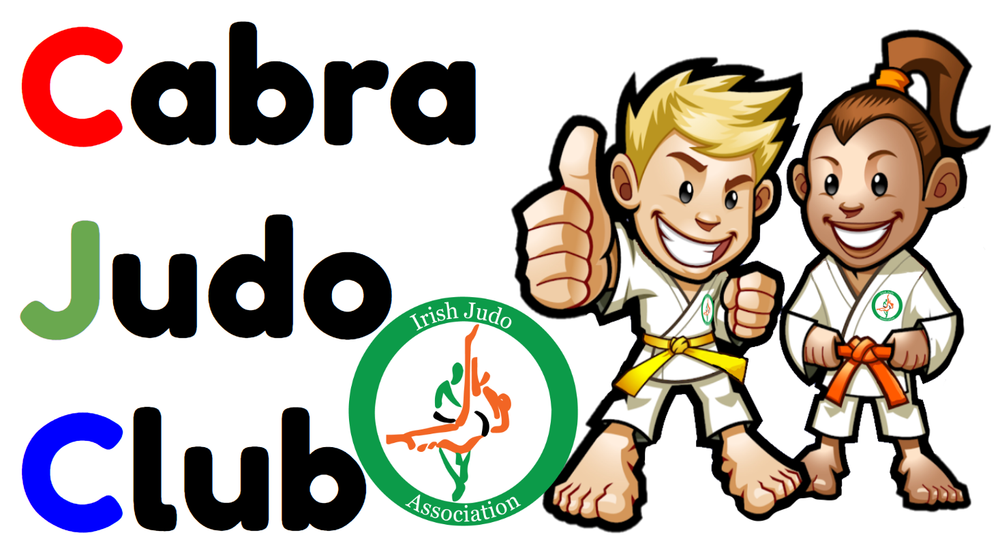

[//]: # (open new tab in markdown - https://www.mydigitaltoolbox.pro/blog/markdown-kramdown-link-new-tab)
[//]: # (markdown syntax guide - https://coderwall.com/p/hcqhja/coderwall-markdown-cheat-sheet)
[//]: # (markdown cheatsheet - https://github.com/adam-p/markdown-here/wiki/Markdown-Cheatsheet)
[//]: # (jekyll guide - https://jekyllrb.com/docs)
[//]: # (jekyll cheatsheet - https://devhints.io/jekyll)
[//]: # (set up github pages website in 10 mins - https://blog.usejournal.com/set-up-your-portfolio-website-in-less-than-10-minutes-with-github-pages-d0efa8ff56fd)
[//]: # (github cheatsheet - https://help.github.com/en/github/creating-cloning-and-archiving-repositories/cloning-a-repository)
[//]: # (github simple guide - https://rogerdudler.github.io/git-guide/)
[//]: # (jekyll themes - http://jekyllthemes.org/)
[//]: # (jekyll includes - https://jekyllrb.com/docs/includes/)

## News 





## Cabra

**Venue** Cabra Parkside Community Sports Centre, Ratoath Road, Cabra, Dublin 7 [**Map**](https://goo.gl/maps/GkZEBZg8fYvLdPHq8){:target="_blank"} 

**Lessons** Saturday 12:00-13:00 

**Mat fee** 10 &euro;/lesson - *first lesson is free*

## Phibsboro

**Venue** The Space, Phibsboro Shipping Centre, Dublin 7 [**Map**](https://goo.gl/maps/NopZ3FVzMGLtEyDx9){:target="_blank"} 

**Lessons** Saturday 10:00-12:00 

**Mat fee** 10 &euro;/lesson - *first lesson is free*

## Contact Details

**email** cabrajudo@gmail.com

**phone** +353 89 4634940 
